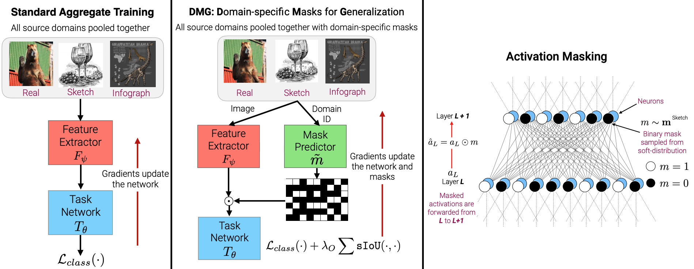

# Domain-Specific-Masks-for-Generalization

Pytorch implementation of the paper:

**Learning to Balance Specificity and Invariance for In and Out of Domain Generalization**   
Prithvijit Chattopadhyay, Yogesh Balaji, Judy Hoffman   
ECCV 2020  

*We introduce Domain-specific Masks for Generalization, a model for improving both in-domain and out-of-domain generalization performance. For domain generalization, the goal is to learn from a set of source domains to produce a single model that will best generalize to an unseen target domain. As such, many prior approaches focus on learning representations which persist across all source domains with the assumption that these domain agnostic representations will generalize well. However, often individual domains contain characteristics which are unique and when leveraged can significantly aid in-domain recognition performance. To produce a model which best generalizes to both seen and unseen domains, we propose learning domain specific masks. The masks are encouraged to learn a balance of domain-invariant and domain-specific features, thus enabling a model which can benefit from the predictive power of specialized features while retaining the universal applicability of domain-invariant features. We demonstrate competitive performance compared to naive baselines and state-of-the-art methods on both PACS and DomainNet.*

   

Table of Contents
=================

   * [Setup and Dependencies](#setup-and-dependencies)
   * [Usage](#usage)
      * [Logging](#logging)
      * [Download and setup data](#download-and-setup-data)
      * [Training](#training)
   * [Reference](#reference)

## Setup and Dependencies

Our code is implemented in PyTorch (v1.2.0). To setup, do the following:
1. Install [Anaconda](https://docs.anaconda.com/anaconda/install/linux/)
2. Get the source:
```
git clone https://github.com/prithv1/DMG.git DMG
```
3. Install requirements into the `dmg` virtual environment, using [Anaconda](https://anaconda.org/anaconda/python):
```
cd DMG
conda env create -f environment.yml
conda activate dmg
```

## Usage

### Download and setup data

To download the associated datasets (PACS and DomainNet), execute the following:  

1. [DomainNet](http://ai.bu.edu/M3SDA/)
```
cd data/DomainNet/
chmod +x download.sh && chmod +x create_dataset.sh
./download.sh
./create_dataset.sh
```
2. [PACS](http://www.eecs.qmul.ac.uk/~dl307/project_iccv2017)  
Download created hdf5 files from the [drive folder](https://drive.google.com/drive/folders/1i23DCs4TJ8LQsmBiMxsxo6qZsbhiX0gw?usp=sharing) and place all the `hdf5` files under `data/PACS/`

### Logging

For logging, we use [Weights & Biases](https://docs.wandb.com/). Installing wandb is handled by conda environment creation instructions. Go to the instructions [page](https://docs.wandb.com/quickstart) and create a free account and login from your shell.

### Training

Training is managed via experiment configs in the `configs/` folder. To run a job corresponding to a specific multi-source domain shift, do the following:  

1. Aggregate Training (training a CNN jointly on all domains)
```
# Running a job on the DomainNet dataset
python train_model.py \
    --phase aggregate_training \ # training-phase
    --config-yml configs/DomainNet/aggregate_training.yml \ # config-file
    --config-override DATA.DOMAIN_LIST clipart,infograph,painting,quickdraw,real \ # Source domains
    DATA.TARGET_DOMAINS sketch \ # Target domain
    HJOB.JOB_STRING dmnt_v1 \ # Unique job identifier string
    MODEL.BASE_MODEL alexnet # Base CNN architecture
```
2. Multi-head Training (training a CNN with classifier heads per-source domain)
```
# Running a job on the DomainNet dataset
python train_model.py \
    --phase multihead_training \ # training-phase
    --config-yml configs/DomainNet/multihead_training.yml \ # config-file
    --config-override DATA.DOMAIN_LIST clipart,infograph,painting,quickdraw,real \ # Source domains
    DATA.TARGET_DOMAINS sketch \ # Target domain
    HJOB.JOB_STRING dmnt_v1 \ # Unique job identifier string
    MODEL.BASE_MODEL alexnet \ # Base CNN architecture
    MODEL.SPLIT_LAYER classifier.6 # Split base-network at this layer
```
3. Domain-Specific Mask-based Aggregate Training (DMG)
```
# Running a job on the DomainNet dataset
python train_model.py \
    --phase supermask_training \ # training-phase
    --config-yml configs/DomainNet/supermask_training.yml \ # config-file
    --config-override DATA.DOMAIN_LIST clipart,infograph,painting,quickdraw,real \ # Source domains
    DATA.TARGET_DOMAINS sketch \ # Target domain
    HJOB.JOB_STRING dmnt_v1 \ # Unique job identifier string
    MODEL.BASE_MODEL alexnet \ # Base CNN architecture
    MODEL.MASK_LAYERS classifier.1,classifier.4,classifier.6 \ # Layers to mask
    MODEL.MASK_INIT_SETTING random_uniform \ # How to initialize masks
    OPTIM.OVERLAP_LAMBDA 0.1 \ # Strength of overlap penalty
    OPTIM.SPARSITY_LAMBDA 0.0 \ # Strength of sparsity penalty
    MODEL.POLICY_CONV_MODE False # True if masks are applied to a conv-layer
```

The script `run_jobs.sh` contains sample commands to run jobs across different architectures on both PACS and DomainNet.

## Reference

If you use this code as part of any published research,  please cite 
```
@inproceedings{2020EccvDMG, 
author = {Chattopadhyay, Prithvijit and Balaji, Yogesh and Hoffman, Judy},
title = {Learning to Balance Specificity and Invariance for In and Out of Domain Generalization},
year = 2020,
booktitle = {European Conference in Computer Vision (ECCV)}
}
```
